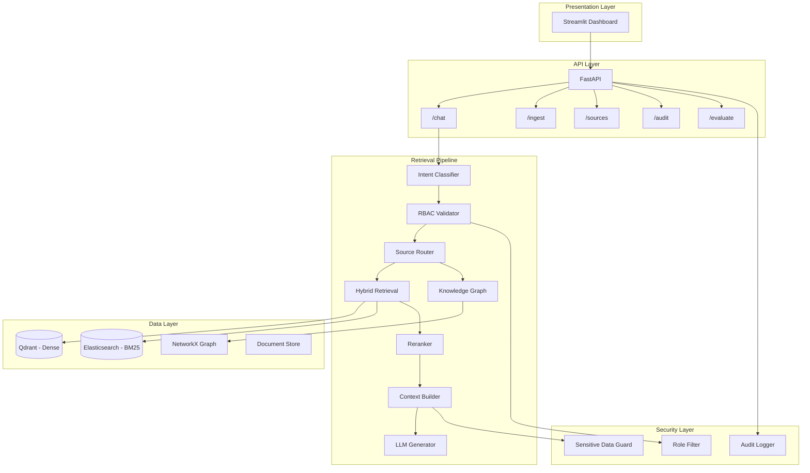

# Enterprise RAG Intelligence Platform — Architecture

## Overview

Production-grade Retrieval-Augmented Generation (RAG) platform with RBAC, hybrid search, knowledge graph, and full observability.

## System Architecture



## Retrieval Flow

```
User Query
    ↓
Intent Classifier (LLM / keyword fallback)
    ↓
RBAC Validator (filter authorized doc IDs BEFORE retrieval)
    ↓
Source Router (route to relevant data silos)
    ↓
Hybrid Retrieval (0.6 semantic + 0.4 BM25)
    ↓
Knowledge Graph Retrieval (multi-hop reasoning)
    ↓
Reranker (BGE Cross-Encoder, top 5)
    ↓
Sensitive Data Check
    ↓
Context Builder → LLM → Grounded Answer + Citations
```

## Folder Structure

```
enterprise-rag/
├── app/
│   ├── main.py                 # FastAPI entry
│   ├── config.py               # Settings
│   ├── api/routes.py           # REST endpoints
│   ├── security/               # RBAC + sensitive data
│   ├── retrieval/              # Classifier, router, hybrid, reranker
│   ├── ingestion/              # PDF, SQL, CSV, JSON processors
│   ├── storage/                # Qdrant, ES, embeddings
│   ├── knowledge_graph/        # NetworkX graph
│   ├── generation/             # LLM answer generation
│   ├── evaluation/             # RAG metrics
│   └── observability/          # Logging, tracing, audit
├── streamlit_app/app.py        # UI dashboard
├── scripts/generate_synthetic_data.py
├── tests/unit/ & tests/integration/
├── docker-compose.yml
└── Dockerfile
```

## RBAC Model

| Role        | Access Scope                              |
|-------------|-------------------------------------------|
| Admin       | All departments                           |
| Executive   | Executive, Finance, Compliance            |
| Finance     | Finance documents only                    |
| HR          | HR documents only                         |
| Compliance  | Compliance documents only                 |
| Engineering | Engineering documents only                |

Security is enforced **at retrieval time** via Qdrant/ES filters — unauthorized chunks are never retrieved.

## Hybrid Scoring

```
Hybrid Score = 0.6 × Semantic (cosine) + 0.4 × BM25 (normalized)
```

Implemented via weighted Reciprocal Rank Fusion (RRF).

## Infrastructure (Docker Compose)

- **Qdrant** — Vector database (port 6333)
- **Elasticsearch** — BM25 sparse search (port 9200)
- **API** — FastAPI backend (port 8000)
- **Streamlit** — Dashboard (port 8501)

Fallback mode: In-memory Qdrant + rank_bm25 when external services unavailable.
